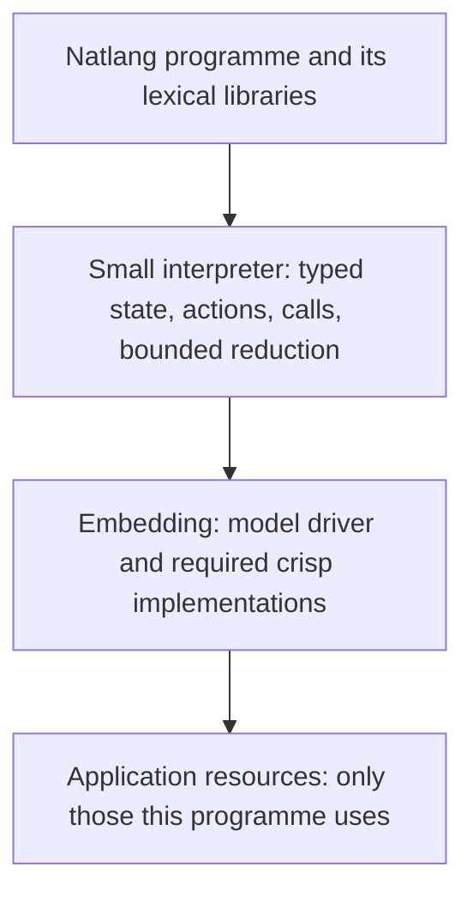

# A small natlang core, embedded in different worlds

Revised design proposal, 2026-09-19. This replaces the earlier infrastructure-first architecture. It separates behavior-preserving refactors from explicitly versioned interface changes. The selected direction now includes multiple crisp engines, explicit random configuration, streams and trace data; implementation and normative specification remain unchanged.

Companions: [20 application plans](AMBITIOUS_PROJECTS.md), [revised delivery roadmap](AMBITIOUS_ROADMAP.md), [targeted implementation refactor](EMBEDDING_REFACTOR.md), [current specification](../spec/SPEC.md).

Concrete interface design: [streams, engines, types, randomness and traces](EXECUTION_INTERFACES.md). Per-project delivery: [individual implementation plans and dependency matrix](projects/README.md). That document records the latest decisions and supersedes older alternatives.

Concrete cross-project implementation sequence: [infrastructure plan](INFRASTRUCTURE_IMPLEMENTATION.md).

## 1. The design centre

Natlang is a small interpreter for typed natural-language functions. A function receives values, follows its instructions, calls functions and produces a value. Some functions are interpreted by a model; others execute exactly. The embedding application supplies the outside world.

Three costs matter whenever we add something:

1. **Learning cost:** what must a weak interpreter model newly recognise, choose and execute correctly?
2. **Semantic cost:** what additional states, interactions and failure cases must authors and implementations understand?
3. **Porting cost:** what must every embedding implement, even when its application does not need the feature?

A feature can have little model cost but substantial porting cost. Hiding a compulsory database or scheduler behind a function does not make the core small. Conversely, replacing a useful existing combinator with elaborate model-managed bookkeeping may reduce implementation size while making interpretation less reliable. The aim is a small, coherent set of obligations across all three dimensions.

The organising rule is:

> Extend the functions available to a programme before extending the operations available to its interpreter.

This is a presumption, not a prohibition. A library solution that repeatedly confuses the student can justify a better primitive. We must demonstrate that tradeoff with actual programmes.

## 2. What was wrong with the previous plan

The previous architecture grouped durable jobs, event logs, artifacts, capability brokers, search, multiple evaluators and scheduling into an initial shared substrate. That was a useful inventory of application needs, but an unnecessarily large foundation for a language.

It also blurred three different changes: fixing an existing semantic inconsistency, adding a host implementation facility, and teaching the interpreter a new abstraction. Calling all three “runtime improvements” obscured their costs. Moving everything to an optional module would not resolve the problem if ordinary programmes still depended on the entire module collection.

The replacement is compositional. A programme depends on its reachable functions. Those functions depend on specified evaluator implementations and host operations. An embedding supplies that closure and the small interpreter contract. An application with no persistent effects needs no persistent effect subsystem.

## 3. Three layers, with one ordinary call boundary



| Layer | Owns | Does not imply |
|---|---|---|
| Interpreter core | Typed state, scope, action validation, function invocation, current bounded combinators, completion/quiescence | Threads, disk, SQL, a job service, a browser or a network |
| Programme and libraries | Algorithms, domain types, semantic decisions, exact helpers, recovery policy | Globally available tools or ambient access to other functions |
| Embedding | Model invocation, required crisp execution, host resources, limits and optional scheduling/observation | A universal standard deployment stack |

A library function may itself be natlang, crisp code, or a wrapper around a supplied host operation. The caller uses the same typed `call` mechanism. Prefer a small domain interface such as `render_preview(plan)` over making every application manipulate a generic job protocol.

The host must not take over the programme's semantic control flow. For example, natlang chooses a media recipe, assesses the preview and decides whether to revise it. Exact helpers compile the chosen operation and invoke the media engine. A single host function that secretly performs the whole semantic workflow would defeat the purpose.

The distinction is semantic, not the implementation language: a 20-line Python function can contain too much application policy, and a larger exact renderer can be an appropriate host implementation.

## 4. Preserve the existing kernel first

The current kernel already provides typed values, lexical function definitions, private locals, validated writes, crisp execution, blocking calls, bounded Map/Fold/Iterate reduction, failure reporting and provenance. Preserve those meanings while reviewing existing inconsistencies. This proposal does not replace them with a new abstract machine.

The model continues to work with its familiar operations: read values, write results, call functions, perform exact snippets where supported, specialise existing functions, mark progress under the selected existing policy, or report a blocker/error. Do not add global `search`, `spawn`, `await`, `sql`, `asset`, `delegate` or `transaction` tools for the proposed applications. Generalise the existing `run_code` tool instead; the concrete proposal adds a required, constrained `engine` argument in a versioned surface.

Keep several properties explicit:

- A function sees its own state and its declared lexical codebase.
- Types are checked at the boundary; a host result has no special exemption.
- Calls obey the declared embedding authority contract. Mediated effects retain parent/child checks; shared-host engines must explicitly describe native access that is not mediated.
- Completion requires a valid result under the existing completion rules.
- Failure or quiescence does not imply that external effects were undone.
- Work remains bounded; an embedding may impose tighter limits.
- The harness does not interpret prose to choose application branches.

Current implementation facts that need attention:

| Observation | Small response |
|---|---|
| Draft spec promises parallel Map; implementation is serial | Define logical semantics independently of execution strategy. No parallel implementation prerequisite. |
| Tool count, value transport and completion wording have drifted | Reconcile documentation and conformance around deliberate behavior. |
| `OpenList` is a blocking iterator and open Map handling differs from Fold | Document supported behavior. Use host-driven finite invocations for new reactive prototypes. |
| Effectful QuickJS has a short deadline; a timed-out host callback may finish | Correct adapter behavior for the consuming application; do not promise implicit retry or rollback. |
| `Blob` currently accepts strings and file import reads text | Use an ordinary domain reference when an application needs binary data. |
| Trace identities/state are not a complete durable restart format | Improve diagnostic capture when needed; durability is a separate optional requirement. |

These observations are grounded in `natlang/runtime.py`, `js.py`, `host.py`, `values.py`, `surface.py`, and `spec/SPEC.md`. They do not all warrant core extensions.

## 5. A narrow embedding interface

Describe the seam before choosing a universal API. The current Python implementation hardcodes parts of crisp execution; isolating that dependency may eventually be a small refactor. The following responsibilities are the target contract, not newly implemented interfaces:

| Seam | Core expects | Embedding may vary |
|---|---|---|
| Interpreter decision | Next proposed action/reply from the supplied episode context | Local model, remote model, recorded decisions, batching strategy |
| Crisp invocation | A result or explicit failure for a supplied body/binding and typed inputs, under allowed effects | QuickJS, another selected engine, a native implementation, local or remote execution |
| Execution limits | Bounded execution and explicit exhaustion/failure | Resource accounting, cancellation mechanism, device constraints |

Existing types and function declarations carry the semantics. Initially retain current effect-name checks for mediated access and supply host bindings through the existing mechanism; there is no need to design a general capability-broker package first. Shared-host engines may intentionally expose direct native access under a separately declared environment contract. A callback must enforce its actual resource authority. A text handle or declared effect name does not authorise arbitrary resource access.

Diagnostic observation is useful but should not require durable storage. A small host can discard optional observations; a development host can collect traces; a durable service can persist them. Existing model-visible provenance still needs its specified semantics. Do not silently remove observable state in the name of an optional observer.

Avoid a universal effect envelope that forces every host to implement job IDs, cancellation acknowledgements, transaction IDs, causal clocks and replay policies. Those belong to services that need them. If a later debugger needs stable logical identity, add the minimum identity mechanism and assess it independently of a database or event store.

## 6. Scheduling without teaching a new language

### One logical call, several implementations

From the interpreter's perspective, a call runs until it returns or quiesces. The embedding may implement that wait synchronously, via a callback, through an event loop, or on a worker. A nonblocking implementation of a call need not expose a model-visible future.

The present runtime uses synchronous Python control flow. Cooperative suspension is therefore a potential implementation change, not something the existing code already supports. If a browser or other target requires it, first try suspending at existing model/crisp call boundaries while preserving the tool transcript and call semantics. Internal continuation state need not become a new language construct or a durable serialisation format.

### Parallelism is an execution choice where it is unobservable

For Map, preserve item binding, output order, scope and partial-result behavior. A host may run independent items sequentially or concurrently. Fold remains ordered; Iterate retains its existing bounded progression. A single-threaded target implements no worker pool.

Do not assume effect-free model calls are deterministic. Parallelisation is transparent only when it preserves the declared observable behavior: inputs/context, per-call randomness where specified, results and relevant diagnostics/effects. Pin logical child identities rather than deriving random streams from completion order. Budget exhaustion can depend on scheduling; specify/report that limit instead of promising identical partial outcomes under every resource budget.

Begin with independent pure work on hosts that can support it. Keep effectful work in the defined sequential order unless an application explicitly opts into weaker ordering through its library contract. That opt-in is not a new argument every interpreter call must understand.

### Reactive applications can be ordinary functions

An application can use:

```text
step(state, event) -> new_state
```

The host delivers one event, invokes the function, and retains the returned state. A simple host runs this in memory. A game embeds it in its loop. A server may queue events; a reliable service may persist them. The programme can emit effects through its declared functions. A data-only planner may instead return a typed action plan that the host executes exactly as specified; the host must not infer missing semantic decisions.

No universal event envelope, mailbox type or coroutine syntax is required. The application chooses its event record. Cross-event state is explicit data, so many applications can restart at event boundaries without saving a suspended model episode.

Coroutines become candidates only if representative programmes need to suspend and compose independent work in ways that this approach expresses poorly. We should compare a library/event formulation with a proposed primitive on the student before changing the language.

### Selected stance: events are stream inputs

Incoming events are expressed as streams consumed by Map/Fold for now. A temporarily empty stream waits in the host; closure ends input; Fold processes events serially. An event arriving during a Fold step waits for that step to finish. Models can be trained to tolerate parallelism and interleaved activity, but this does not require injecting messages into active lambda episodes.

Complete the existing partial streaming implementation before adding another mechanism. Specify bounded buffering, source errors, output order and the distinction between incremental delivery and final completion. In particular, an unbounded Map cannot simply accumulate one ever-growing list. The [execution interface proposal](EXECUTION_INTERFACES.md) identifies that open representation/history question rather than claiming it is already solved.

In-episode interrupts remain an alternative only if stream composition proves inadequate for a concrete task. This preserves explicit inputs and the simplicity of function application while allowing the surrounding execution to be eventful.

## 7. Crisp execution, shared environments and common types

Generalise crisp execution now. The host supplies a small table of engine bindings; `run_code(engine, code)` explicitly selects among those made available to the function. With one engine the schema offers one value. Authored crisp functions resolve their engine at load time, so ordinary `call` still needs no additional selection. Introduce the required argument through a versioned surface with trace/training migration.

An engine binding identifies language, implementation and environment. Isolation policy is separate: retain the QuickJS sandbox as one implementation, and support intentionally shared host environments as another. A host may expose native application objects directly. Environment lifetime, side effects, cancellation and enforcement guarantees must be declared honestly. Keep natlang-owned state behind checked boundaries even when eval can mutate host-owned state.

Search, references to host-owned data and meta-operations should initially live in those crisp environments. The model can call exact code to search data, operate on native resources, load another programme or inspect a trace. No extra global model tools or mandatory artifact store are needed. Ordinary IDs/summaries can cross the natlang boundary when necessary.

Use one TS-style type system for natlang across all engines: the existing small structural subset, not the complete TypeScript type checker. Engine adapters convert values at the boundary and the same validator applies. Missing values, Null, numbers and unsupported native objects need consistent conversion rules. Keep native objects inside their environment initially; a nominal opaque host-type escape hatch is a proposal to evaluate only if real code needs it. Avoid `Any` or a different natlang type system per engine.

Portability has three levels: compatible language semantics; availability of a programme's library/evaluator/environment dependencies; and, where requested, reproducible model execution. A programme containing arbitrary TS snippets still requires an implementation of their contract. Native helpers or different engines are explicit ports, not silent substitutes. An embedded game need not supply the media editor's engines to be a valid natlang host.

See [execution interfaces](EXECUTION_INTERFACES.md) for evaluator contracts, type escape-hatch questions, seed configuration and the portable trace format.

## 8. Place each ambition at the smallest suitable layer

| Need | Initial representation | Host requirement only when used |
|---|---|---|
| Binary media | Native resources in crisp environment; ordinary IDs/summaries where needed | Bind the actual host data and access contract |
| Long rendering/build | Ordinary domain function call | Engine invocation with an appropriate implementation of waiting |
| Background interaction | Application state and completion/progress events | Job tracking only for that interactive host |
| SQL | Typed query helper or explicit SQL-dependent library | Database and query boundary |
| Search own data | Crisp code over the supplied environment or passed collection | Optional index; in-memory search is a valid start |
| Vector retrieval | Optional retrieval-library implementation | Embeddings/index only where justified |
| Stronger model help | A declared domain helper such as `inspect_frame` | Suitable model service, with explicit failures and limits |
| UI | Ordinary view records returned by natlang | Renderer and event delivery |
| Dependency resolution | Library/build-time operation | Resolver only in development/package tooling |
| Build cache | Build-application data and exact helper functions | Cache storage for that application |
| Durable effects | Domain-specific receipts and recovery programme | Persistence/idempotency/reconciliation where required |
| Execution/debugging trace | Portable reduction records, inspectable through crisp meta-APIs | Optional sink/storage; explicit reconstruction/replay coverage |
| Semantic merge | Natlang functions over histories or state/updates | Shared model/seed execution settings and update transport |

These are placement decisions, not commitments to implement a module for every row. A file identifier does not require a content-addressed artifact service. A callback table does not require a broker framework. A synchronous render does not require a job queue. More demanding product requirements can justify each later.

Optionality must hold transitively: importing a text helper must not initialise a database, import an inference engine, or pull in process supervision. Keep optional dependencies outside the core import path. Share a helper after actual consumers establish a common contract; do not start with a universal service registry.

## 9. Weak-model ergonomics

A fixed tool inventory alone is insufficient. Hundreds of library functions or complicated result protocols would recreate the same difficulty inside `call`.

Keep functions short, lexical menus small, signatures concrete and errors local. Preserve current limits until measurements justify changes. Expose only the domain operations needed by an episode. Prefer `preview(plan)` to a sequence of generic submit/poll/acknowledge/reconcile operations unless the programme's purpose is to manage such a workflow.

Do not conceal relevant uncertainty. If rendering may have finished after a timeout, its library can return a small domain result distinguishing success, definite failure and unknown outcome. The workflow must handle that difference when it matters. Host-only diagnostic metadata need not occupy the model's context on every successful call.

Measure proposed interfaces by whole-program student success, wrong bindings, confused states, false success, turns and tokens. Compare against the current interface on the same cases. Teacher competence is not enough evidence that a weak interpreter can use a new abstraction.

Library conventions also have learning costs. Stabilise the conventions that recur; keep special cases local. Train representative uses of the same small mechanisms across applications instead of a separate tool language per project.

## 10. Semantic replication under this design

P02 remains a notional CRDT: natlang decides merges semantically, using history reduction or state plus update. This revision does not reintroduce crisp convergence rules.

The shared model and random seed are embedding configuration. Supply the same programme, input presentation and context; derive independent random streams from stable logical merge/call identity so unrelated work cannot consume the merge's randomness. Pin the relevant inference configuration and test reproducibility on the supported backend. These settings should not become extra choices the interpreter must make during a merge.

Same-input repeatability and sensitivity to update order/grouping remain separate experiments. An application can reconcile a common history or agree on a checkpoint while leaving the actual merge semantic. A target that cannot reproduce the agreed execution profile can still run other natlang programmes; it simply does not satisfy that replication mode's contract.

## 11. A test for admitting core changes

For every proposed addition, answer:

1. Which executable programme fails to express its behavior with current functions/types/combinators?
2. Is the problem model behavior, a missing domain helper, a host limitation, or a semantic limitation?
3. What is the smallest library/embedding alternative, including its real model burden?
4. What must the student newly learn? Which existing patterns become simpler?
5. What must a single-threaded host and a massively parallel host implement?
6. Can unused support be omitted, including transitive dependencies?
7. What interactions arise with scope, effects, quiescence, budgets and replay?
8. What paired student experiment and conformance cases would justify accepting it?

Possible results are: fix a defect, improve a programme, supply a library, implement a host feature, change an internal seam, or amend core semantics. Do not presume the last result.

Default decisions now: streams through Map/Fold; a required engine selector proposed on the existing eval tool; explicit seed configuration; one TS-style boundary type system; portable reduction trace data; no new global search/meta tools or concurrency primitives. Multiple engines use simple host bindings, and isolation is optional by embedding contract. Persistence, indexes and asset stores remain optional.

## 12. Immediate work

First reconcile the existing execution contract and stage the engine, random-configuration, trace and stream work in the execution-interface plan. Then build three small experiments with current mechanisms: a semantic merge over text, a media transformation through a narrow host adapter, and a small build workflow through declared helpers. Use finite inputs, ordinary calls and in-memory state where sufficient.

Record every apparent missing feature together with its smallest alternative. Test a single-threaded embedding early; test an optional parallel execution strategy on independent work when a consumer warrants it. Extract shared infrastructure only after the applications demonstrate common needs.

The foundation we need first is clarity about what a function call means across embeddings. Richer services can then grow around that boundary without becoming obligations of every natlang programme.
